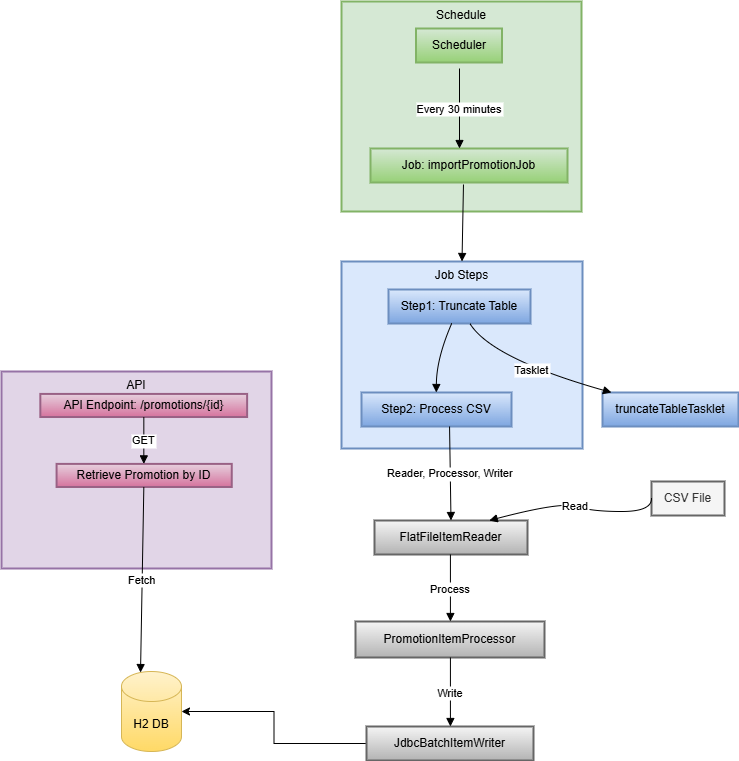
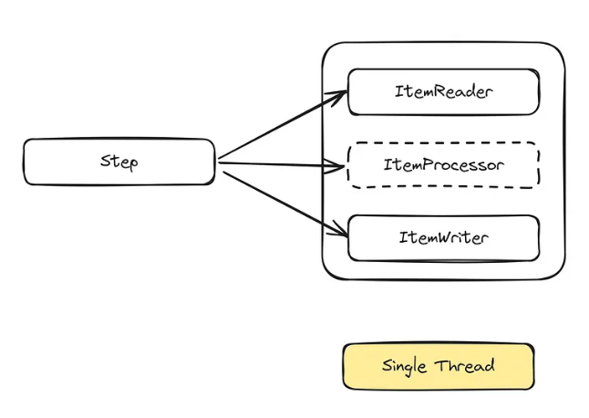
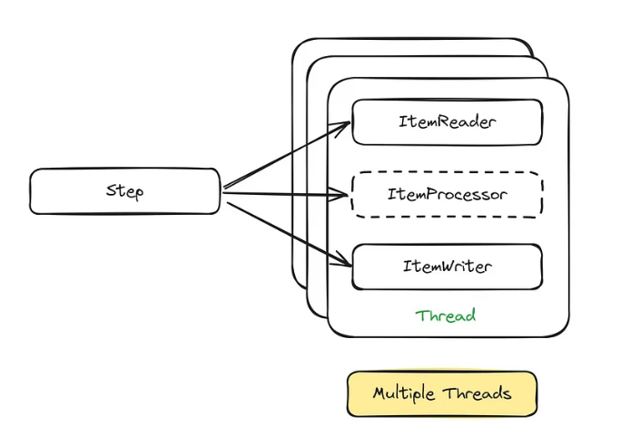

# Promotion Service

This is a Spring Boot application that reads promotion records from a CSV file, stores them in an H2 database, and provides an API to access these records. The records are processed and stored in batches of 5000 to handle large CSV files efficiently.

## Features

- Read promotion records from a CSV file.
- Store promotion records in an H2 database, which can later be changed to any SQL database.
- Provide an API to access promotion records by ID.
- Batch processing to handle large datasets.

## Prerequisites

- Java 17
- Maven
- Docker (optional, for containerized deployment)

## Getting Started

### Build and Run using Maven

```bash
git clone https://github.com/Anji17/promotions-service.git
cd promotions-service
mvn clean install
mvn spring-boot:run
curl -X GET http://localhost:1321/promotions/D018EF0B-DBD9-48F1-AC1A-EB4D90E57118
```

### Build and Run using Docker

```bash
docker build -t promotion-service .

docker run -d -p 1321:1321 promotion-service
```

#### Response

```json
{
  "id": "D018EF0B-DBD9-48F1-AC1A-EB4D90E57118",
  "price": 60.683466,
  "expiration_date": "2018-08-04 05:32:31"
}
```

### H2 Database

The application uses an H2 in-memory database. You can access the H2 console at http://localhost:1321/h2-console with the following credentials:

- JDBC URL : jdbc:h2:mem:testdb
- Username : user
- Password : password

## Code Flow



### Description

- CSV File: The source of the data to be processed.
- FlatFileItemReader: Reads data from the CSV file.
- PromotionItemProcessor: Processes each item read from the CSV file and converts date from CEST to UTC timezone, and saving ID in uppercase.
- JdbcBatchItemWriter: Writes the processed data to the H2 database.

### Job Steps

- Step1 : Drop Table:
Tasklet: Executes a task to truncate the existing data in the PROMOTION table.
- Step2 : Process CSV:
FlatFileItemReader: Reads data from the CSV file.
PromotionItemProcessor: Processes each read item.
JdbcBatchItemWriter: Writes the processed data to the database.

### Job Execution

Job is scheduled to run at an interval of 30 minutes.

Job: importPromotionJob consists of the two steps: Step1 and Step2.
The job starts with Step1 (truncate the table) and then proceeds to Step2 (processing the CSV file).

### Schedule

- Scheduler: The job importPromotionJob is scheduled to run every 30 minutes.

```java
@Scheduled(fixedRate = 1800000)
public BatchStatus loadAndSaveData() throws JobInstanceAlreadyCompleteException, JobExecutionAlreadyRunningException, JobParametersInvalidException, JobRestartException {
        JobParameters jobParameters = new JobParametersBuilder()
                .addDate("timestamp", Calendar.getInstance().getTime())
                .toJobParameters();
        JobExecution jobExecution = jobLauncher.run(job, jobParameters);
        return jobExecution.getStatus();
    }
```

Spring Batch uses several metadata tables to manage and track the execution of batch jobs. These tables store information about job executions, step executions, and other related data. Here's a list of the primary metadata tables used by Spring Batch:

- BATCH_JOB_INSTANCE
- BATCH_JOB_EXECUTION
- BATCH_JOB_EXECUTION_PARAMS
- BATCH_STEP_EXECUTION
- BATCH_STEP_EXECUTION_CONTEXT

More details [here](https://docs.spring.io/spring-batch/reference/schema-appendix.html)

### API

API Endpoint: /promotions/{id}

- GET: Retrieves a promotion by ID from the H2 database.

```json
{
  "id": "D018EF0B-DBD9-48F1-AC1A-EB4D90E57118",
  "price": 60.683466,
  "expiration_date": "2018-08-04 05:32:31"
}
```

API Health check: /actuator/health

```json
{
    "status": "UP"
}
```

## Questions 

1. The .csv file could be very big (billions of entries) - how would your application perform? How would you optimize it?

Since I've used Spring batch here and currently it is using Single thread to process file in chunks (batch size = 5000). To optimize it, we can do parallel processing.

Parallel Processing : We can have multithreading at Step level, and it executes every chunk in its own thread.

Current Process :



Multi-threaded Process :



Note : Currently this process is scheduled, batch-oriented processing. It guarantees data integrity through transaction management and can be a more cost-effective solution. However, if demand is real-time or near-real-time processing, we can use Spark Java framework. Its in-memory computing and distributed processing capabilities make it a strong choice for data-intensive applications. However, its operational costs can be high due to the need for substantial resources.

2. How would your application perform in peak periods (millions of requests per minute)? How would you optimize it?

- Caching: The application can manage a high volume of requests by implementing a caching mechanism (e.g., Redis) to store frequently accessed data.
- Horizontal Scaling: If necessary, we can run multiple instances of the application.
- Load Balancing: To handle numerous requests, a load balancer can be placed at the entry point.

3. How would you operate this app in production (e.g. deployment, scaling, monitoring)?

- The application can be deployed in a containerized environment using Docker which can help in portability, isolation and scalability of the application.
- Using some container orchestration tool like Kubernetes for scalability, self healing and resource management.
- Utilize CI/CD pipelines for automated builds, tests, and deployments, which helps in faster release cycle, improved code quality and reduced manual efforts.
- Use monitoring tools (e.g., Prometheus, Grafana) to collect and visualize metrics and also helps in setting up alerts in case of critical issues.
- Deploy the application on cloud platforms (e.g., AWS, GCP, Azure) for better scalability, reliability and alerting mechanism. For example : We can utilize Amazon S3 to store CSV files and setup an S3 Event Notification which can be used by Amazon SQS queue to process files. It will be push mechanism to trigger file processing instead of polling.